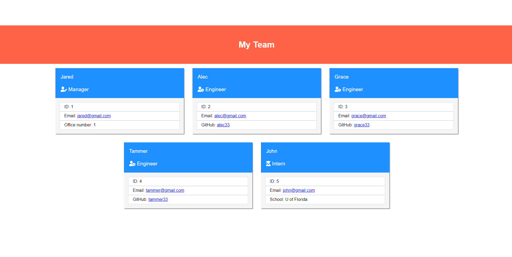

# README by Jungwoo Lee
  

## 1. Title: WEEK10_Team_Profile_Generator

## 2. Table of Contents:
This readme file includes the following contents:
+ [Description](#3-description)
+ [Installation](#4-installation)
+ [Usage](#5-usage)
+ [License](#6-license)
+ [Application results](#7-application-results)
+ [Questions](#8-questions)

## 3. Description: 
This application takes in information about employees on a software engineering team, then generates an HTML webpage that displays summaries for each person.

This application utilizes Node.js command-line, Object-Oriented Programming (OOP), and Test-Driven Development (TDD) using Jest.

## 4. Installation:
Please make sure to have following programs installed on your computer to use this app:
+ VS Code
+ GitBash
+ Node.js

To generate your own README, `git clone` the repo down to your local. Then, run `npm install` in order to install the `npm` package dependencies as specified in the `./package.json` - `inquirer v8.2.4` and `jest v24.9.0` will be installed. Now, you are ready to go!

## 5. Usage:
When you run `node index.js`, the application uses the `inquirer` package to prompt you in the command line with a series of questions about the project team; the firt question is about the team manager, then questions about the team members will be prompted. Then, answer the prompts in your command line. Then, team organization HTML file will be generated in `./dist/index.html` - this is the final product of this application. 

This project has the following directory structure:
+ ./&#95;&#95;tests&#95;&#95;
  + Employee.test.js: jest test for the Employee class
  + Engineer.test.js: jest test for the Engineer class
  + Intern.test.js: jest test for the Intern class
  + Manager.test.js: jest test for the Manager class
+ ./dist
  + ./assets/css/reset.css: reset pre-defined css styles
  + ./assets/css/style.css: main css style for the html file
  + index.html: team profile HTML webpage file that is created from this application
+ ./lib
  + Employee.js: Employee class constructor
  + Engineer.js: Engineer class constructor
  + Intern.js: Intern class constructor
  + Manager.js: Manager class constructor
+ ./old: old sources, so you can ignore this for the final product
+ ./src
  + generate_html.js: HTML generation code - this will generate /dist/index.html
+ ./index.js: main Node.js code for this project
+ ./LICENSE: MIT License 
+ ./package.json: specifics of npm's package.json handling

## 6. License:
### The MIT License
  

## 7. Application results:
View walk through video here - [Screencastify](https://drive.google.com/file/d/162OBXcoEi2j0b17gBEBZJA68Ahlj61RZ/view?usp=share_link) 
or the original video file is in `./dist/assets/WEEK10_Team_Profile_Generator.avi`

## 8. Questions?:
If you have any questions, feel free to contact me via information below:\
[GitHub:] https://github.com/jungwoo33\
[Email:] jungwoo33@gmail.com

- - -
© 2023 Jungwoo Lee. Confidential and Proprietary. All Rights Reserved.